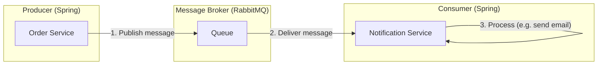
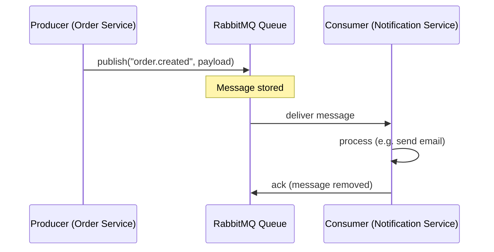

# Message Queue — Concept & Spring Demo

## What is a Message Queue?

A **message queue** is a buffer that holds messages between a **producer** (sender) and a **consumer** (receiver). Instead of calling each other directly, services put messages into the queue and take them out asynchronously.

### Why use one?

| Benefit | Description |
|--------|-------------|
| **Decoupling** | Producer and consumer don’t need to know about each other or be up at the same time. |
| **Async processing** | Producer can continue without waiting for the consumer to finish. |
| **Load leveling** | Spikes in traffic are absorbed by the queue; consumers process at their own pace. |
| **Reliability** | Messages persist until consumed; if a consumer fails, messages aren’t lost. |

### Simple analogy

Like a **post office**: you drop a letter (message) in a mailbox (queue). The post office holds it until the recipient (consumer) is ready to pick it up. You don’t have to meet the recipient in person.

---

## Architecture Diagram



### Sequence: publish → queue → consume



---

## This Demo

- **Producer**: REST endpoint that enqueues an "order" message.
- **Queue**: RabbitMQ (simulated via Docker or cloud).
- **Consumer**: Listener that receives the message and logs it (stand-in for sending email/notification).

### Run the demo

1. Start RabbitMQ (e.g. Docker):  
   `docker run -d --name rabbitmq -p 5672:5672 -p 15672:15672 rabbitmq:3-management`
2. Run the Spring Boot app:  
   `./mvnw spring-boot:run`
3. Send a message:  
   `curl -X POST http://localhost:8080/orders -H "Content-Type: application/json" -d "{\"orderId\":\"ORD-001\",\"customerId\":\"cust-1\",\"amount\":99.99}"`
4. Watch the console: the consumer will log the received order.

---

## Project layout

```
message-queue-demo/
├── README.md                 # This file (concept + diagram)
├── pom.xml
└── src/main/java/.../mqdemo/
    ├── MessageQueueDemoApplication.java
    ├── config/
    │   └── RabbitMQConfig.java    # Queue and exchange binding
    ├── producer/
    │   └── OrderController.java   # Publishes to queue
    └── consumer/
        └── OrderMessageListener.java  # Consumes from queue
```
